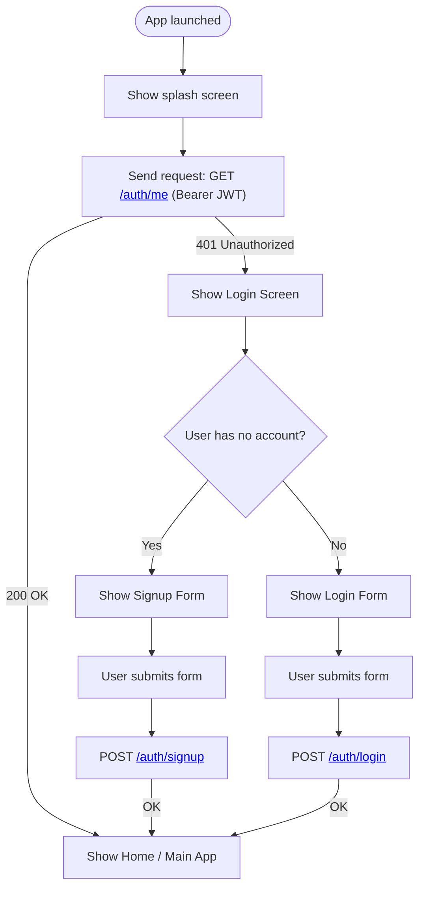
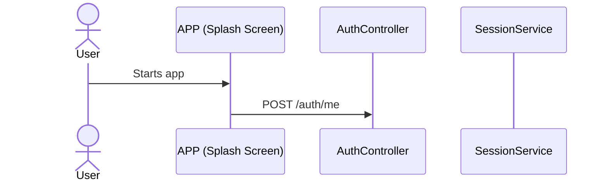
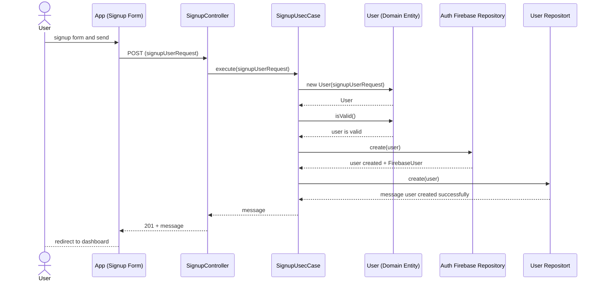
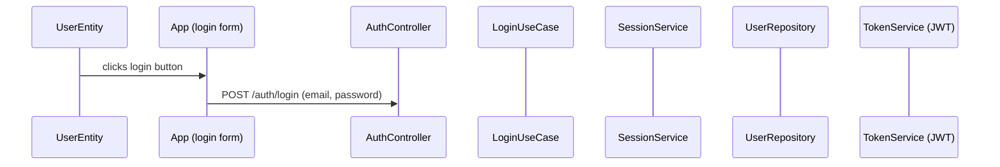

<!-- 
Controllers only receive HTTP requests and return HTTP responses.

Use Cases (Application layer) enforce business rules using Domain logic.

Repositories assume that all rules have already been checked before saving.

Services are the bitches of the use cases 
-->

# AUTH

### Start

### GET /auth/me 

### POST /auth/signup

### POST /auth/login

