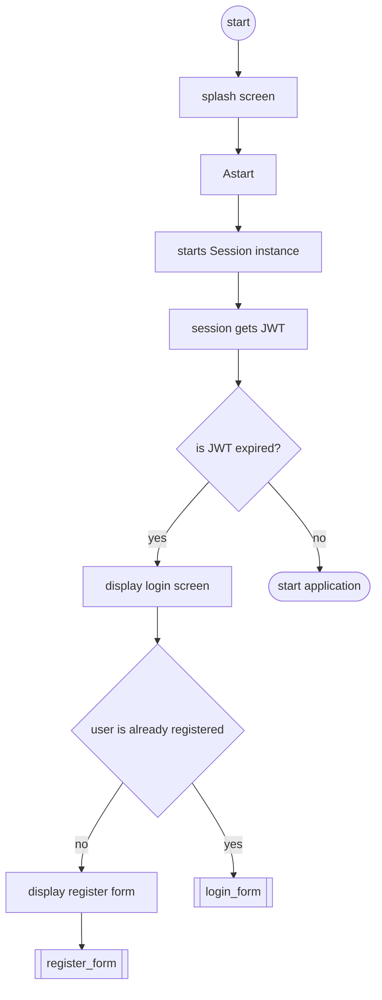
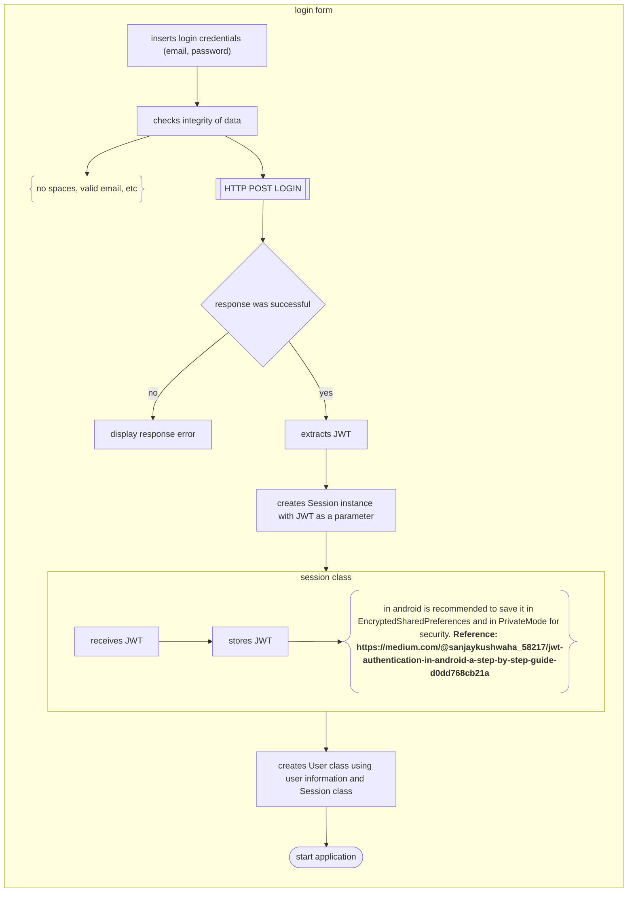
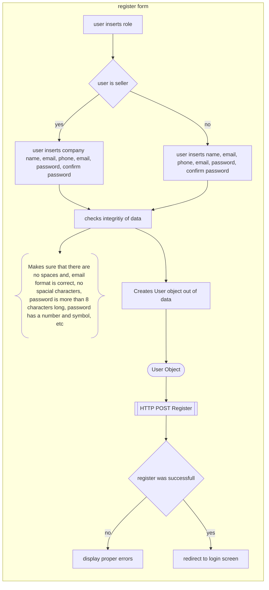
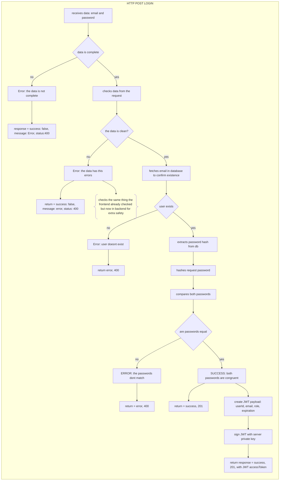
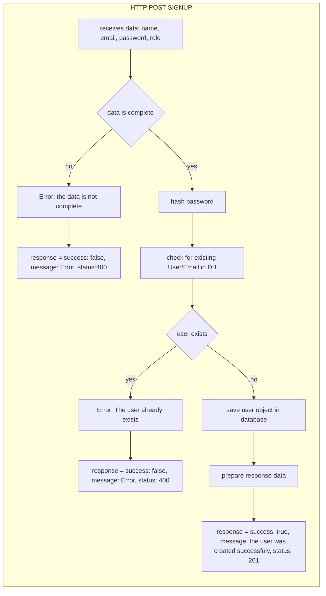
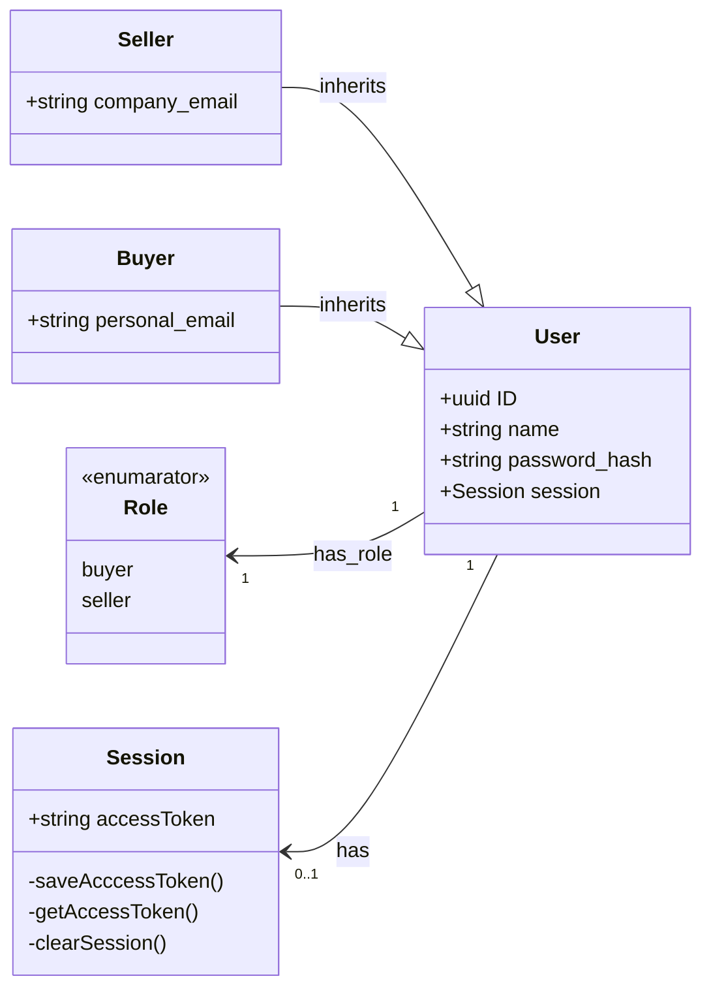

# AUTH

### Start

```mermaid
flowchart TD
  start((start))
  start --> A[splash screen]
  A -->
  Astart --> AA[starts Session instance]
  AA --> AB[session gets JWT]
  AB --> AC{is JWT expired?}
  AC -- yes --> B
  AC -- no --> AD([start application])
  B[display login screen]
  B--> C{user is already registered}
  C -- no --> CA[display register form] --> CB[[register_form]]
  C -- yes --> D[[login_form]]

```

### Login

```mermaid
flowchart TD
  subgraph login_form [login form]
  direction TB
  A["inserts login credentials (email, password)"]
  A --> B[checks integrity of data] --> Bex@{ shape: braces, label: "no spaces, valid email, etc" }
  B --> C[["HTTP POST LOGIN"]]
  C --> D{response was successful}
  D -- no --> Derr[display response error]
  D -- yes --> E[extracts JWT]
  E --> F[creates Session instance with JWT as a parameter]
  subgraph FClass[session class]
  FA[receives JWT]
  FA --> FB[stores JWT] --> Fex@{shape: braces, label: "in android is recommended to save it in EncryptedSharedPreferences and in PrivateMode for security. <b>Reference<b/>: <a>https://medium.com/@sanjaykushwaha_58217/jwt-authentication-in-android-a-step-by-step-guide-d0dd768cb21a</a>"}
  end
  F --> FClass
  FClass --> G[creates User class using user information and Session class]
  G --> 
  finish([start application])
  end

```

### Signup 

```mermaid 
flowchart TD
  subgraph register_form [register form]
    direction TB
    
     B[user inserts role]
    B --> C{user is seller}
    C -- yes --> CA[user inserts company name, email, phone, email, password, confirm password]
    C -- no --> CB[user inserts name, email, phone, email, password, confirm password]
    CA & CB --> D[checks integritiy of data] --> Dex@{ shape: braces, label: "Makes sure that there are no spaces and, email format is correct, no spacial characters, password is more than 8 characters long, password has a number and symbol, etc"}
    D --> F[Creates User object out of data]
    F --> G([User Object])
    G --> H[[HTTP POST Register]]
    H --> I{register was successfull}
    I -- no --> Ierr[display proper errors]
    I -- yes --> J[redirect to login screen]
  end
```

### HTTP POST Login

```mermaid
flowchart TD
  subgraph http_post_login [HTTP POST LOGIN]
  direction TB
    A[receives data: email and password]
    A--> B{ data is complete}
    B -- no --> Berr[Error: the data is not complete] --> Breturn[response = success: false, message: Error, status:400]
    B -- yes --> C[checks data from the request]
    C --> D{the data is clean?}
    D -- no --> Derr[Error: the data has this errors] --> Dret[return = success: false, message: error, status: 400]
    Derr --> Derrex@{shape: braces, label: "checks the same thing the frontend already checked but now in backend for extra safety"}
    D -- yes --> E[fetches email in database to confirm existence]
    E --> F{user exists}
    F -- no --> Ferr[Error: user doesnt exist] --> Fret[return error, 400]
    F -- yes --> G[extracts password hash from db]
    G --> H[hashes request password]
    H --> I[compares both passwords]
    I --> J{are passwords equal}
    J -- no --> Jerr[ERROR: the passwords dont match] -->  Jret[return = error, 400]
    J -- yes --> K[SUCCESS: both passwords are congruent] --> Kret[return = success, 201]
    K --> L[create JWT payload: userId, email, role, expiration]
    L --> M[sign JWT with server private key]
    M --> N[return response = success, 201, with JWT accessToken]
  end
```

### HTTP POST Signup

```mermaid
flowchart TD
  subgraph http_post_signup [HTTP POST SIGNUP]
    direction TB
    A[receives data: name, email, password, role]
    A --> B{data is complete}
    B -- no --> Berr[Error: the data is not complete] --> Breturn[response = success: false, message: Error, status:400]
    B -- yes --> C[hash password]
    C --> D[check for existing User/Email in DB]
    D --> E{user exists}
    E -- yes --> Eerr[Error: The user already exists] --> Eret[response = success: false, message: Error, status: 400]
    E -- no --> F[save user object in database]
    F --> G[prepare response data]
    G --> Gre[response = success: true, message: the user was created successfuly, status: 201]
  end
```

## Classes

```mermaid
classDiagram
  direction RL

  class User {
    +uuid ID
    +string name
    +string password_hash
    +Session session
  }

  class Seller {
    +string company_email
  }

  class Buyer {
    +string personal_email
  }

  class Role{
    <<enumarator>>
    buyer
    seller
  }

  class Session {
  +string accessToken

  -saveAcccessToken()
  -getAccessToken()
  -clearSession()
  }

  User <|-- Seller : inherits
  User <|-- Buyer : inherits

  User "1" --> "1" Role : has_role

  User "1" --> "0..1" Session: has
```