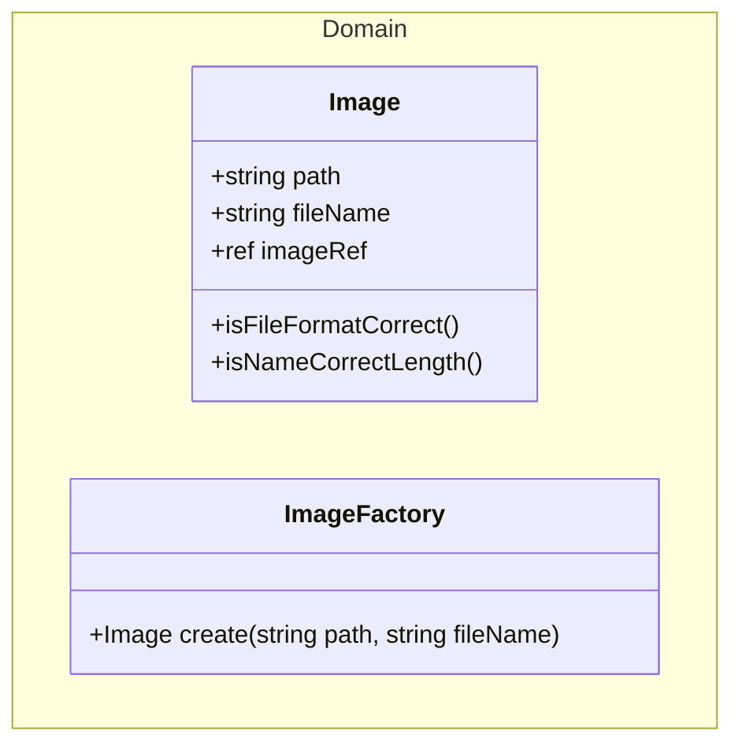

```mermaid
classDiagram
  direction TB
  namespace Domain {
    class Image {
      +string path
      +string fileName
      +ref imageRef

      +isFileFormatCorrect()
      +isNameCorrectLength()
    }
    class ImageFactory {
      +Image create(string path, string fileName)
    }
  }

```