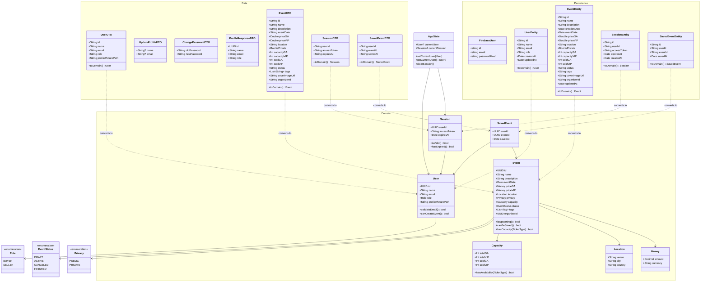

# Classes 

```mermaid
classDiagram
  direction TB
  
  %% DOMAIN LAYER - Business Logic
  namespace Domain {
    class User {
      +UUID id
      +String name
      +String email
      +Role role
      +String profilePicturePath
      +validateEmail() bool
      +canCreateEvent() bool
    }
    
    class Event {
      +UUID id
      +String name
      +String description
      +Date eventDate
      +Money priceGA
      +Money priceVIP
      +Location location
      +Privacy privacy
      +Capacity capacity
      +EventStatus status
      +List~Tag~ tags
      +UUID organizerId
      +isUpcoming() bool
      +canBeSaved() bool
      +hasCapacity(TicketType) bool
    }
    
    class Session {
      +UUID userId
      +String accessToken
      +Date expiresAt
      +isValid() bool
      +hasExpired() bool
    }
    
    class SavedEvent {
      +UUID userId
      +UUID eventId
      +Date savedAt
    }
    
    class Capacity {
      +Int totalGA
      +Int totalVIP
      +Int soldGA
      +Int soldVIP
      +hasAvailability(TicketType) bool
    }
    
    class Location {
      +String venue
      +String city
      +String country
    }
    
    class Money {
      +Decimal amount
      +String currency
    }
  }
  
  %% DATA LAYER - DTOs for API/Network
  namespace Data {

    class UserDTO {
      +String id
      +String name
      +String email
      +String role
      +String profilePicturePath
      +toDomain() User
    }

    class UpdateProfileDTO {
      +String? name
      +String? email
    }

    class ChangePasswordDTO {
      +String oldPassword
      +String newPassword
    }

    class ProfileResponseDTO {
      +UUID   id
      +String name
      +String email
      +String role 
    }
    
    class EventDTO {
      +String id
      +String name
      +String description
      +String eventDate
      +Double priceGA
      +Double priceVIP
      +String location
      +Bool isPrivate
      +Int capacityGA
      +Int capacityVIP
      +Int soldGA
      +Int soldVIP
      +String status
      +List~String~ tags
      +String coverImageUrl
      +String organizerId
      +toDomain() Event
    }
    
    class SessionDTO {
      +String userId
      +String accessToken
      +String expiresAt
      +toDomain() Session
    }
    
    class SavedEventDTO {
      +String userId
      +String eventId
      +String savedAt
      +toDomain() SavedEvent
    }
  }
  
  %% PERSISTENCE LAYER - Database Entities
  namespace Persistence {
      class FirebaseUser {
      +string id
      +string email
      +string passwordHash
    }

    class UserEntity {
      +String id
      +String name
      +String email
      +String role
      +Date createdAt
      +Date updatedAt
      +toDomain() User
    }
    
    class EventEntity {
      +String id

      +String name
      +String description
      +Date creationDate
      +Date eventDate
      +Double priceGA
      +Double priceVIP
      +String location
      +Bool isPrivate
      +Int capacityGA
      +Int capacityVIP
      +Int soldGA
      +Int soldVIP
      +String status
      +String tags
      +String coverImageUrl
      +String organizerId
      +Date updatedAt
      +toDomain() Event
    }
    
    class SessionEntity {
      +String id
      +String userId
      +String accessToken
      +Date expiresAt
      +Date createdAt
      +toDomain() Session
    }
    
    class SavedEventEntity {
      +String id
      +String userId
      +String eventId
      +Date savedAt
      +toDomain() SavedEvent
    }
  }
  
  %% ENUMS - Shared across layers
  class Role {
    <<enumeration>>
    BUYER
    SELLER
  }
  
  class EventStatus {
    <<enumeration>>
    DRAFT
    ACTIVE
    CANCELED
    FINISHED
  }
  
  class Privacy {
    <<enumeration>>
    PUBLIC
    PRIVATE
  }
  
  %% APPLICATION STATE
  class AppState {
    +User? currentUser
    +Session? currentSession
    +setCurrentUser(User)
    +getCurrentUser() User?
    +clearSession()
  }
  
  %% Domain Relationships
  User --> Role
  Event --> EventStatus
  Event --> Privacy
  Event --> Capacity
  Event --> Location
  Event --> Money
  SavedEvent --> User
  SavedEvent --> Event
  Session --> User
  AppState --> User
  AppState --> Session
  
  %% Layer conversions
  UserDTO ..> User : converts to
  EventDTO ..> Event : converts to
  SessionDTO ..> Session : converts to
  SavedEventDTO ..> SavedEvent : converts to
  
  UserEntity ..> User : converts to
  EventEntity ..> Event : converts to
  SessionEntity ..> Session : converts to
  SavedEventEntity ..> SavedEvent : converts to
```

<!-- 
Example on how to structure my classes
/domain
   User.swift
   Event.swift

/data
   UserDTO.swift
   EventDTO.swift

/persistence
   UserEntity.swift
   EventEntity.swift
-->