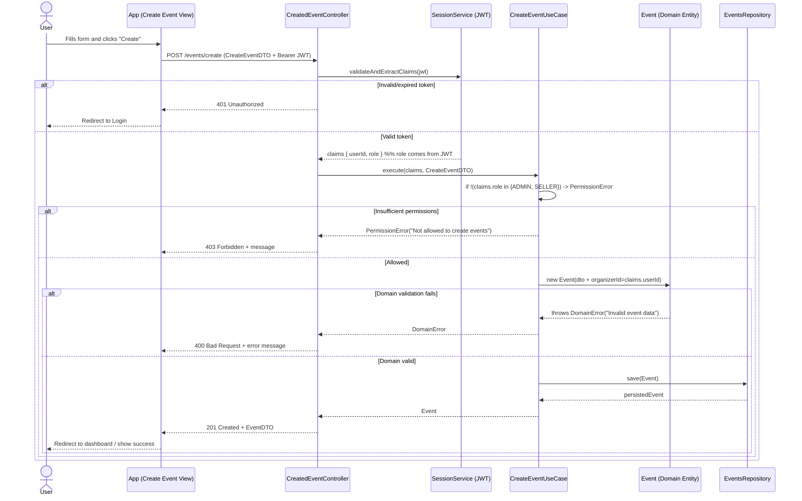
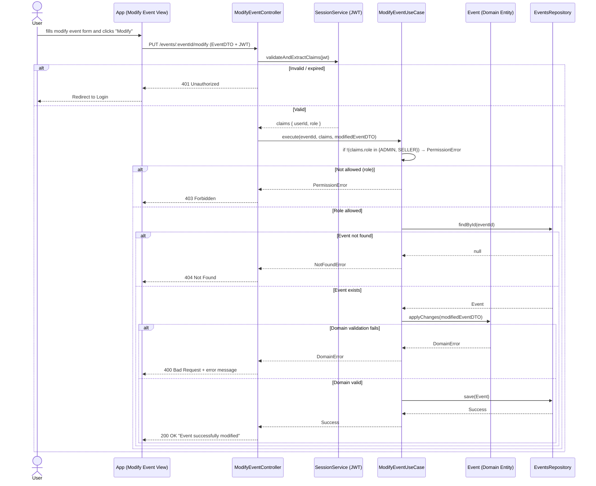
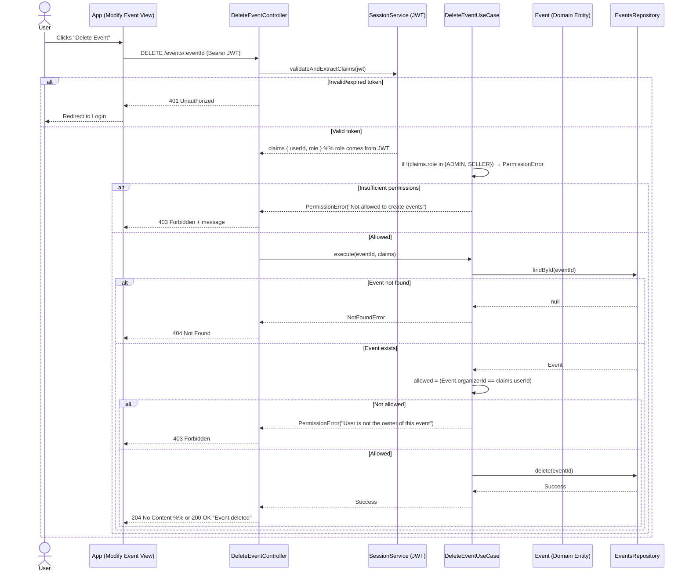

### POST /events/create

```mermaid
sequenceDiagram
  actor User
  participant UI as App (Create Event View)
  participant Controller as CreatedEventController
  participant Session as SessionService (JWT)
  participant UseCase as CreateEventUseCase
  participant Event as Event (Domain Entity)
  participant EventsRepo as EventsRepository

  User->>UI: Fills form and clicks "Create"
  UI->>Controller: POST /events/create (CreateEventDTO + Bearer JWT)

  Controller->>Session: validateAndExtractClaims(jwt)
  alt Invalid/expired token
      Controller-->>UI: 401 Unauthorized
      UI-->>User: Redirect to Login
  else Valid token
      Session-->>Controller: claims { userId, role }   %% role comes from JWT
      Controller->>UseCase: execute(claims, CreateEventDTO)

      UseCase->>UseCase: if !(claims.role in {ADMIN, SELLER}) -> PermissionError
      alt Insufficient permissions
          UseCase-->>Controller: PermissionError("Not allowed to create events")
          Controller-->>UI: 403 Forbidden + message
      else Allowed
          UseCase->>Event: new Event(dto + organizerId=claims.userId)
          alt Domain validation fails
              Event-->>UseCase: throws DomainError("Invalid event data")
              UseCase-->>Controller: DomainError
              Controller-->>UI: 400 Bad Request + error message
          else Domain valid
              UseCase->>EventsRepo: save(Event)
              EventsRepo-->>UseCase: persistedEvent
              UseCase-->>Controller: Event
              Controller-->>UI: 201 Created + EventDTO
              UI-->>User: Redirect to dashboard / show success
          end
      end
  end
```

### PUT /events/:eventId/modify

```mermaid
sequenceDiagram
  actor User
  participant UI as App (Modify Event View)
  participant Controller as ModifyEventController
  participant Session as SessionService (JWT)
  participant UseCase as ModifyEventUseCase
  participant Event as Event (Domain Entity)
  participant EventsRepo as EventsRepository

  User->>UI: fills modify event form and clicks "Modify"
  UI->>Controller: PUT /events/:eventId/modify (EventDTO + JWT)

  Controller->>Session: validateAndExtractClaims(jwt)
  alt Invalid / expired
      Controller-->>UI: 401 Unauthorized
      UI-->>User: Redirect to Login
  else Valid
      Session-->>Controller: claims { userId, role }
      Controller->>UseCase: execute(eventId, claims, modifiedEventDTO)

      UseCase->>UseCase: if !(claims.role in {ADMIN, SELLER}) → PermissionError
      alt Not allowed (role)
          UseCase-->>Controller: PermissionError
          Controller-->>UI: 403 Forbidden
      else Role allowed
          UseCase->>EventsRepo: findById(eventId)
          alt Event not found
              EventsRepo-->>UseCase: null
              UseCase-->>Controller: NotFoundError
              Controller-->>UI: 404 Not Found
          else Event exists
              EventsRepo-->>UseCase: Event

              UseCase->>Event: applyChanges(modifiedEventDTO)
              alt Domain validation fails
                  Event-->>UseCase: DomainError
                  UseCase-->>Controller: DomainError
                  Controller-->>UI: 400 Bad Request + error message
              else Domain valid
                  UseCase->>EventsRepo: save(Event)
                  EventsRepo-->>UseCase: Success
                  UseCase-->>Controller: Success
                  Controller-->>UI: 200 OK "Event successfully modified"
              end
          end
      end
  end
```

### DELETE /events/delete

```mermaid
sequenceDiagram
  actor User
  participant UI as App (Modify Event View)
  participant Controller as DeleteEventController
  participant Session as SessionService (JWT)
  participant UseCase as DeleteEventUseCase
  participant Event as Event (Domain Entity)
  participant EventsRepo as EventsRepository

  User->>UI: Clicks "Delete Event"
  UI->>Controller: DELETE /events/:eventId (Bearer JWT)

  Controller->>Session: validateAndExtractClaims(jwt)
  alt Invalid/expired token
      Controller-->>UI: 401 Unauthorized
      UI-->>User: Redirect to Login
  else Valid token
      Session-->>Controller: claims { userId, role }   %% role comes from JWT

      UseCase->>UseCase: if !(claims.role in {ADMIN, SELLER}) → PermissionError
      alt Insufficient permissions
          UseCase-->>Controller: PermissionError("Not allowed to create events")
          Controller-->>UI: 403 Forbidden + message
      else Allowed
        Controller->>UseCase: execute(eventId, claims)
        UseCase->>EventsRepo: findById(eventId)
        alt Event not found
            EventsRepo-->>UseCase: null
            UseCase-->>Controller: NotFoundError
            Controller-->>UI: 404 Not Found
        else Event exists
            EventsRepo-->>UseCase: Event
            UseCase->>UseCase: allowed = (Event.organizerId == claims.userId)
            alt Not allowed
                UseCase-->>Controller: PermissionError("User is not the owner of this event")
                Controller-->>UI: 403 Forbidden
            else Allowed
                UseCase->>EventsRepo: delete(eventId)
                EventsRepo-->>UseCase: Success
                UseCase-->>Controller: Success
                Controller-->>UI: 204 No Content   %% or 200 OK "Event deleted"
            end
        end
      end
      
  end
```