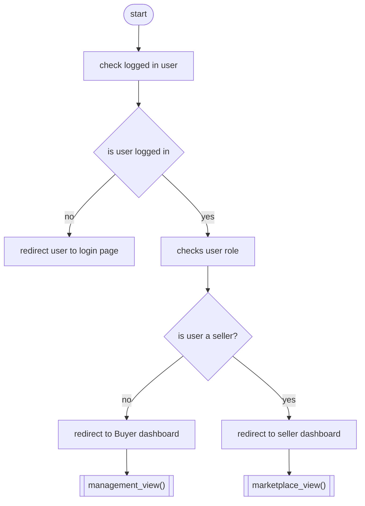
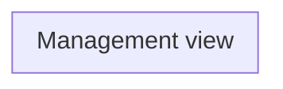
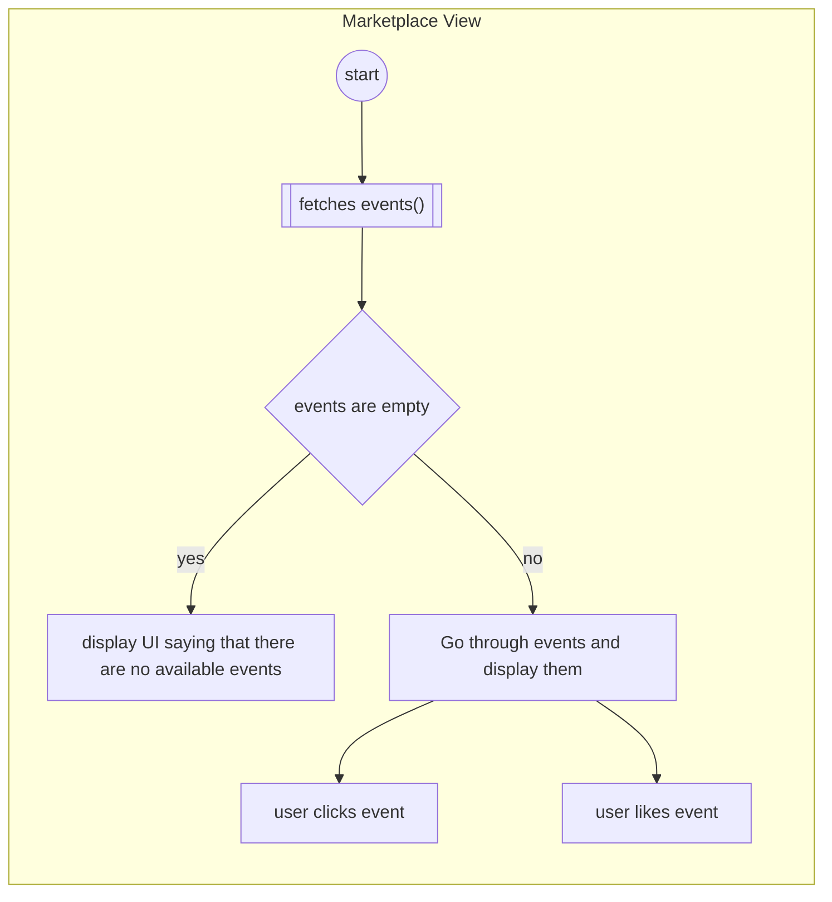
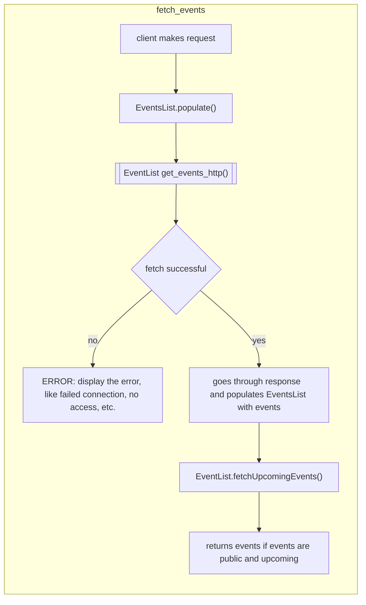
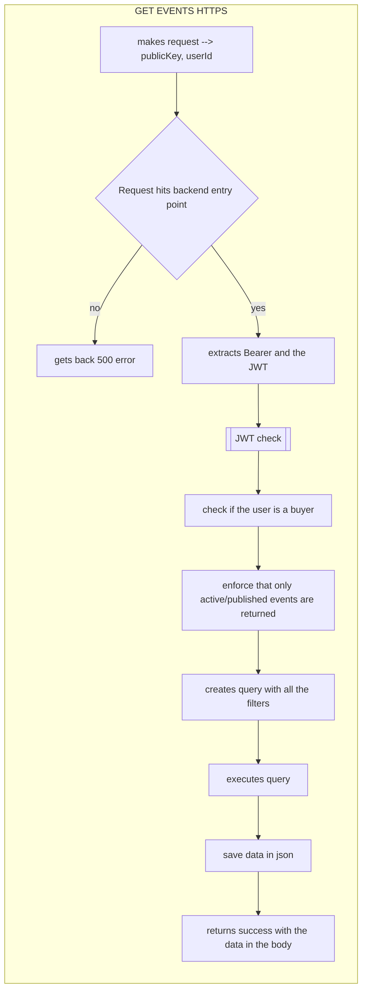
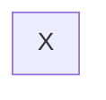
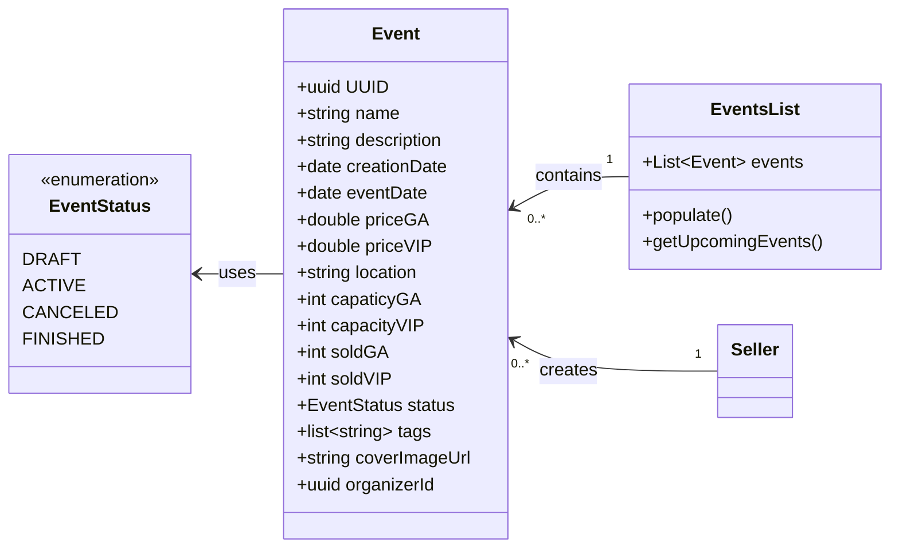

# Dashboard

### Start application

```mermaid
flowchart TD
  start([start])
  start --> AA[check logged in user]
  AA --> AB{is user logged in}
  AB -- no --> ABerr[redirect user to login page]
  AB -- yes --> A[checks user role]
  A --> B{ is user a seller?}
  B -- no  --> BA[redirect to Buyer dashboard] --> BB[["management_view()"]]
  B -- yes --> BC[redirect to seller dashboard] --> BD[["marketplace_view()"]]

```
 

### Management View

```mermaid
flowchart TD
  subgraph management_view[Management view]

  direction TB


  end

```

### Marketplace view

```mermaid
flowchart TD
  subgraph marketplace_view [Marketplace View]
  start((start))-->A
  A[["fetches events()"]]
  A --> B{events are empty}
  B -- yes --> Berr[display UI saying that there are no available events]
  B -- no --> C[Go through events and display them]
  C --> C1[user clicks event] & C2[user likes event]
  direction TB

  end

```

### Fetch events

```mermaid
flowchart TD
  subgraph fetch_events
  direction TB
  A["client makes request"]
  A-->B["EventsList.populate()"]
  B-->C[["EventList get_events_http()"]]
  C-->C2{fetch successful}
  C2 -- no --> C2err[ERROR: display the error, like failed connection, no access, etc.]
  C2 -- yes --> C3[goes through response  and populates EventsList with events]
  C3 --> C32["EventList.fetchUpcomingEvents()"]
  C32 --> C4[returns events if events are public and upcoming]
  end

```

### GET EVENTS HTTPS

```mermaid
flowchart TD
  subgraph get_events_http[GET EVENTS HTTPS]
    direction TB
    CA["makes request --> publicKey, userId"]
    CA --> CB{Request hits backend entry point}
    CB -- no --> CC[gets back 500 error]
    CB -- yes --> CD[extracts Bearer and the JWT]
    CD --> CF[[JWT check]]
    CF --> CG[check if the user is a buyer]
    CG --> CI[enforce that only active/published events are returned]
    CI --> CJ[creates query with all the filters]
    CJ --> CK[executes query]
    CK --> CL[save data in json]
    CL --> CM[returns success with the data in the body]
  end

```

### 

```mermaid
flowchart TD
  subgraph X
  direction TB

  end

```

### 

```mermaid
flowchart TD
  subgraph X
  direction TB

  end

```

### 

```mermaid
flowchart TD
  subgraph X
  direction TB

  end

```

## Classes

```mermaid
classDiagram 
  direction RL

  class EventsList {
    +List~Event~ events
    +populate()
    +getUpcomingEvents()
  }

  class Event{
    +uuid UUID
    +string name
    +string description
    +date creationDate
    +date eventDate
    +double priceGA
    +double priceVIP
    +string location

    +int capaticyGA
    +int capacityVIP
    +int soldGA
    +int soldVIP

    +EventStatus status

    +list~string~ tags
    +string coverImageUrl


    +uuid organizerId
}

class Seller

class EventStatus {
  <<enumeration>>
  DRAFT
  ACTIVE
  CANCELED
  FINISHED
}

EventsList "1"-->"0..*" Event : contains
Seller "1" --> "0..*" Event : creates
Event --> EventStatus : uses

```
