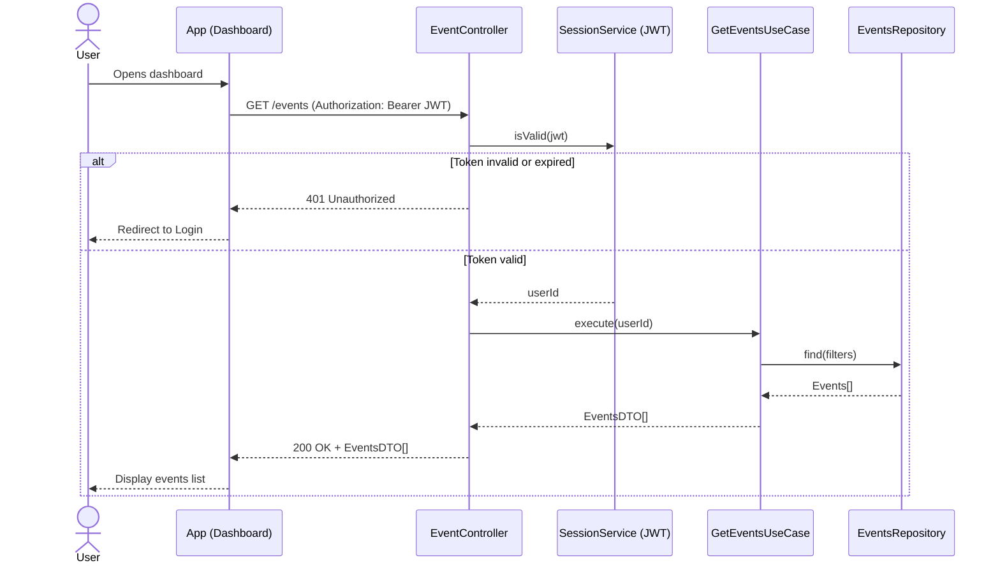
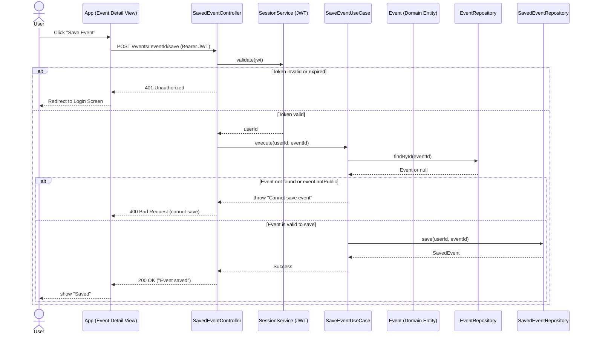

# Dashboard

### Start application

### Get events

```mermaid
sequenceDiagram
  actor User
  participant UI as App (Dashboard)
  participant Controller as EventController
  participant SessionService as SessionService (JWT)
  participant UseCase as GetEventsUseCase
  participant EventsRepo as EventsRepository

  User->>UI: Opens dashboard
  UI->>Controller: GET /events (Authorization: Bearer JWT)

  Controller->>SessionService: isValid(jwt)
  alt Token invalid or expired
      Controller-->>UI: 401 Unauthorized
      UI-->>User: Redirect to Login
  else Token valid
      SessionService-->>Controller: userId
      Controller->>UseCase: execute(userId)
      UseCase->>EventsRepo: find(filters)
      EventsRepo-->>UseCase: Events[]
      UseCase-->>Controller: EventsDTO[]
      Controller-->>UI: 200 OK + EventsDTO[]
      UI-->>User: Display events list
  end
  
```

### POST /events/save

```mermaid
sequenceDiagram
  actor User
  participant UI as App (Event Detail View)
  participant Controller as SavedEventController
  participant SessionService as SessionService (JWT)
  participant UseCase as SaveEventUseCase
  participant EventEntity as Event (Domain Entity)
  participant EventRepo as EventRepository
  participant SavedRepo as SavedEventRepository

  User->>UI: Click "Save Event"
  UI->>Controller: POST /events/:eventId/save (Bearer JWT)

  Controller->>SessionService: validate(jwt)
  alt Token invalid or expired
      Controller-->>UI: 401 Unauthorized
      UI-->>User: Redirect to Login Screen
  else Token valid
      SessionService-->>Controller: userId

      Controller->>UseCase: execute(userId, eventId)
      
      UseCase->>EventRepo: findById(eventId)
      EventRepo-->>UseCase: Event or null
      alt Event not found or event.notPublic
          UseCase-->>Controller: throw "Cannot save event"
          Controller-->>UI: 400 Bad Request (cannot save)
      else Event is valid to save
          UseCase->>SavedRepo: save(userId, eventId)
          SavedRepo-->>UseCase: SavedEvent
          UseCase-->>Controller: Success
          Controller-->>UI: 200 OK ("Event saved")
          UI-->>User: show "Saved"
      end
  end
```