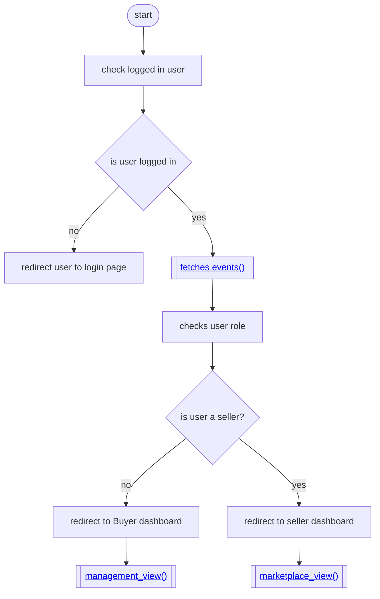
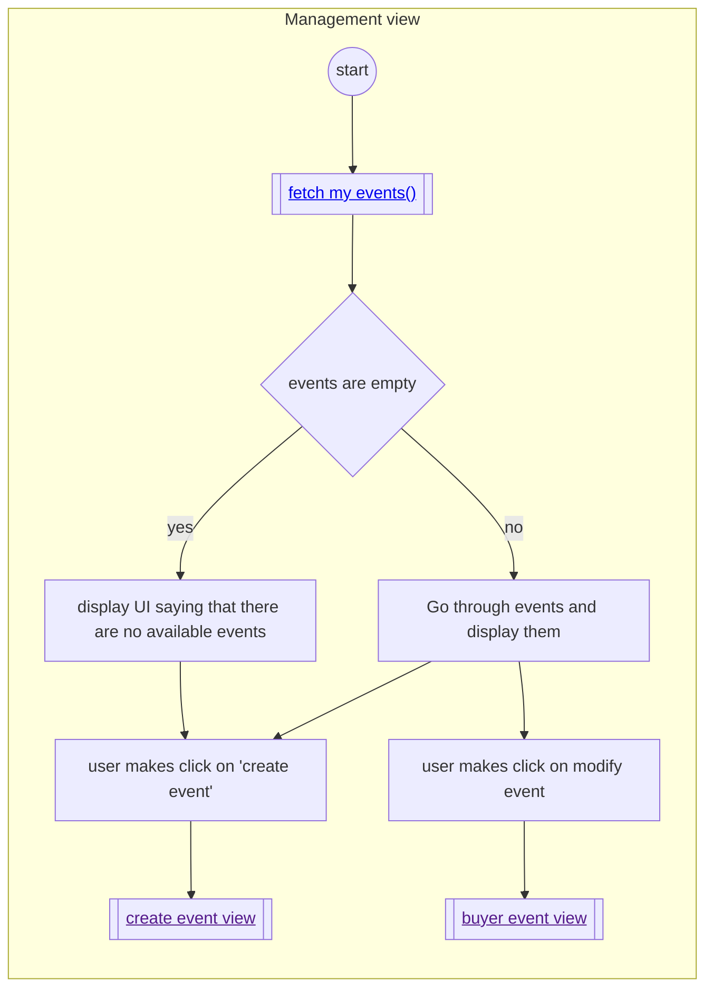
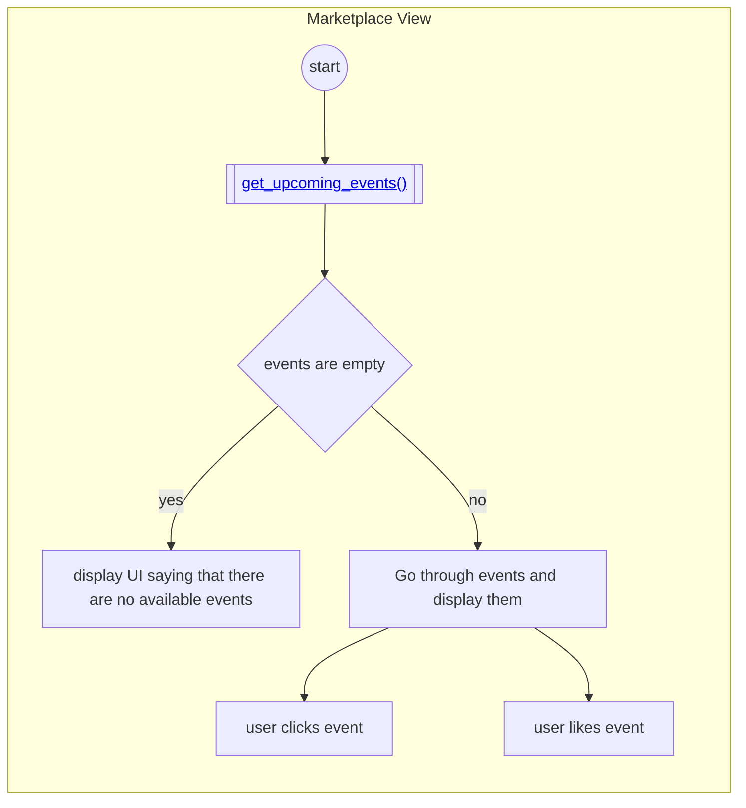
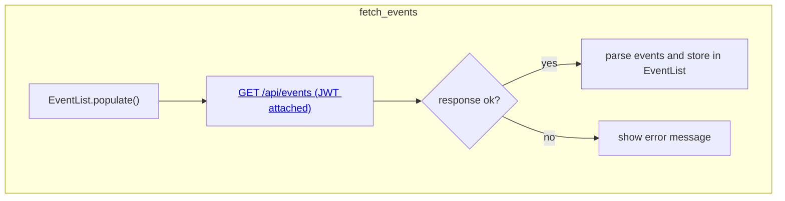
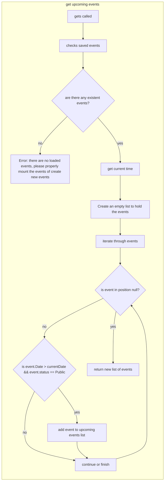
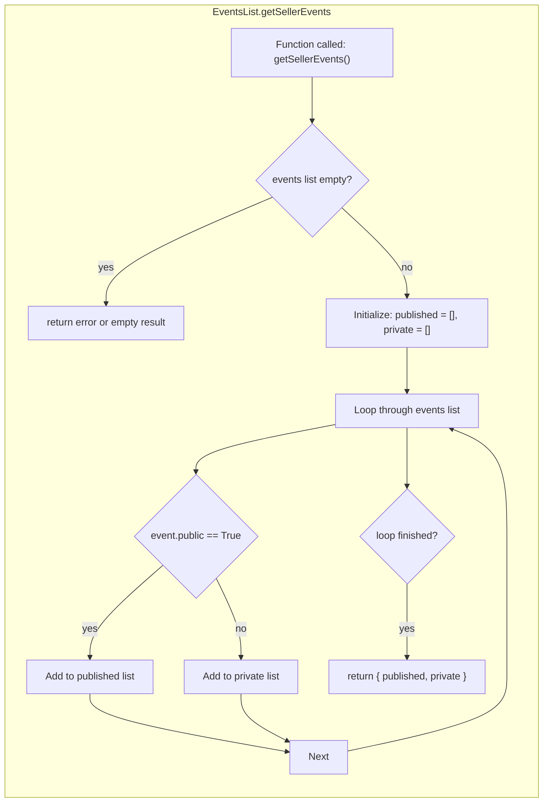
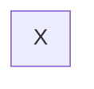
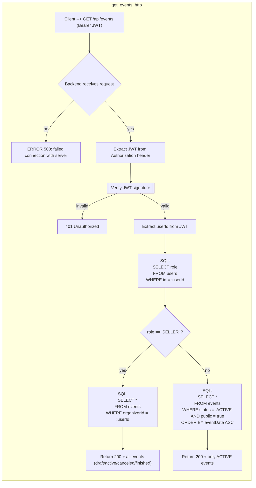

# Dashboard

### Start application

 
### Management View

### Marketplace view

## EventList Class 

### Fetch events

### get upcoming events

### get seller events

### 

### 

### 

### 

## SERVER

### GET EVENTS
> GET /api/events/public-events

