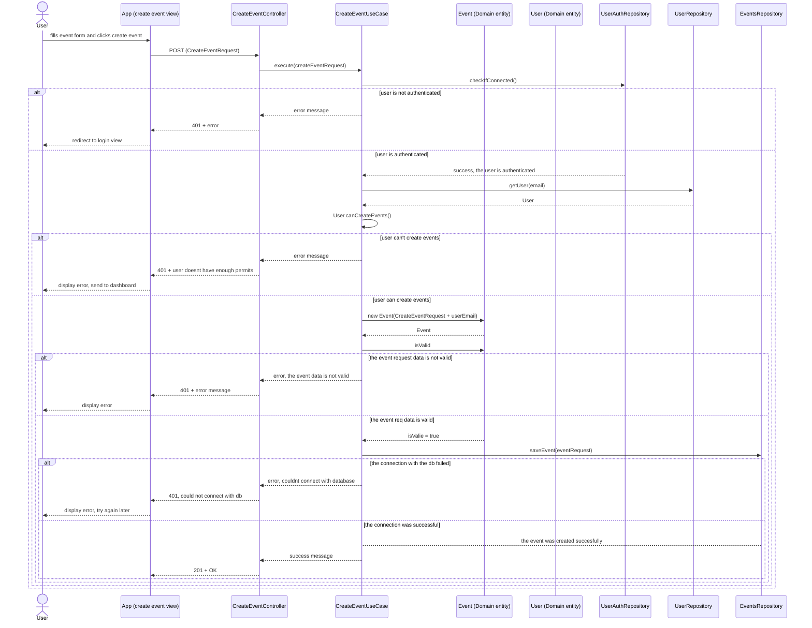

# Create event

```mermaid

sequenceDiagram
actor User
participant UI as App (create event view)
participant Controller as CreateEventController
participant UseCase as CreateEventUseCase
participant EventEntity as Event (Domain entity)
participant UserEntity as User (Domain entity)
participant AuthRepo as UserAuthRepository
participant UserRepo as UserRepository
participant EventRepo as EventsRepository

User->>UI: fills event form and clicks create event
UI->>Controller: POST (CreateEventRequest)
Controller->>UseCase: execute(createEventRequest)
UseCase->>AuthRepo: checkIfConnected()
alt user is not authenticated
  UseCase-->>Controller: error message
  Controller-->>UI: 401 + error
  UI-->>User: redirect to login view
else user is authenticated
AuthRepo-->>UseCase: success, the user is authenticated
UseCase->>UserRepo: getUser(email)
UserRepo-->>UseCase: User
UseCase->>UseCase: User.canCreateEvents()
alt user can't create events
  UseCase-->>Controller: error message
  Controller-->>UI: 401 + user doesnt have enough permits
  UI-->>User: display error, send to dashboard
else user can create events
UseCase->>EventEntity: new Event(CreateEventRequest + userEmail)
EventEntity-->>UseCase: Event
UseCase->>EventEntity: isValid
alt the event request data is not valid
  UseCase-->>Controller: error, the event data is not valid
  Controller-->>UI: 401 + error message
  UI-->>User: display error
else the event req data is valid
EventEntity-->>UseCase: isValie = true
UseCase->>EventRepo: saveEvent(eventRequest)
alt the connection with the db failed
  UseCase-->>Controller: error, couldnt connect with database
  Controller-->>UI: 401, could not connect with db
UI-->>User: display error, try again later
else the connection was successful
EventRepo-->UseCase: the event was created succesfully
UseCase-->>Controller: success message
Controller-->>UI: 201 + OK
end
end
end
end
```