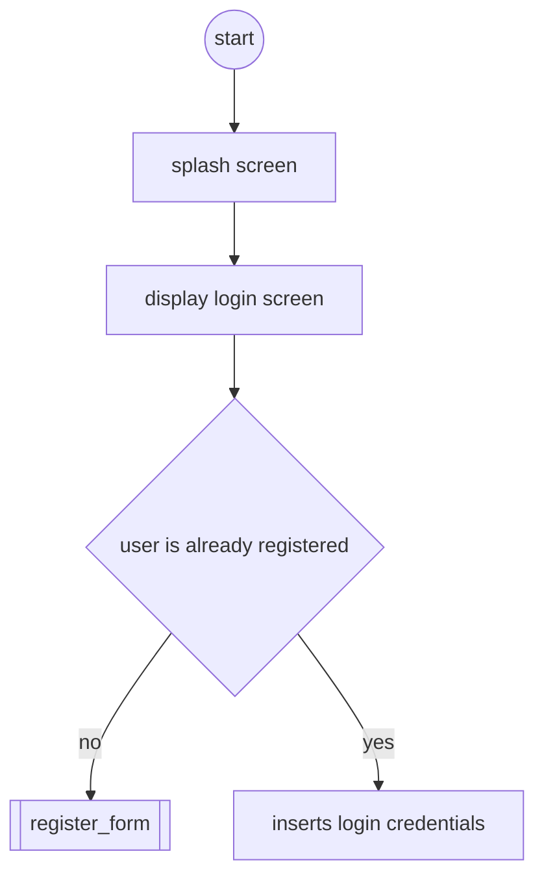
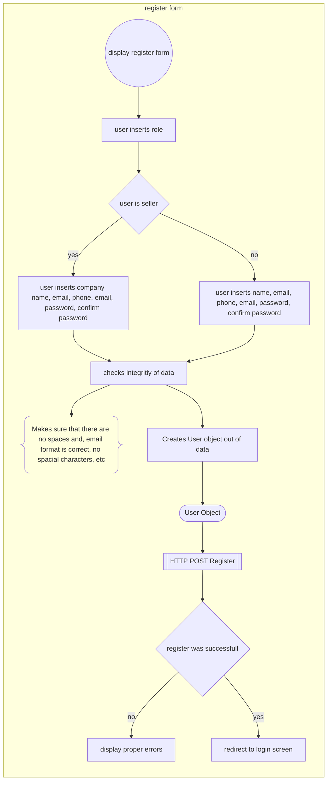
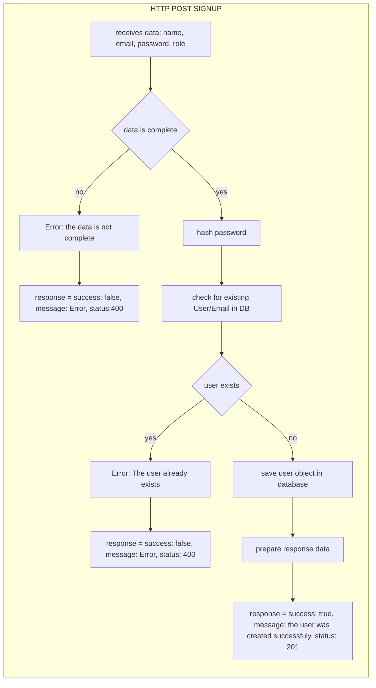
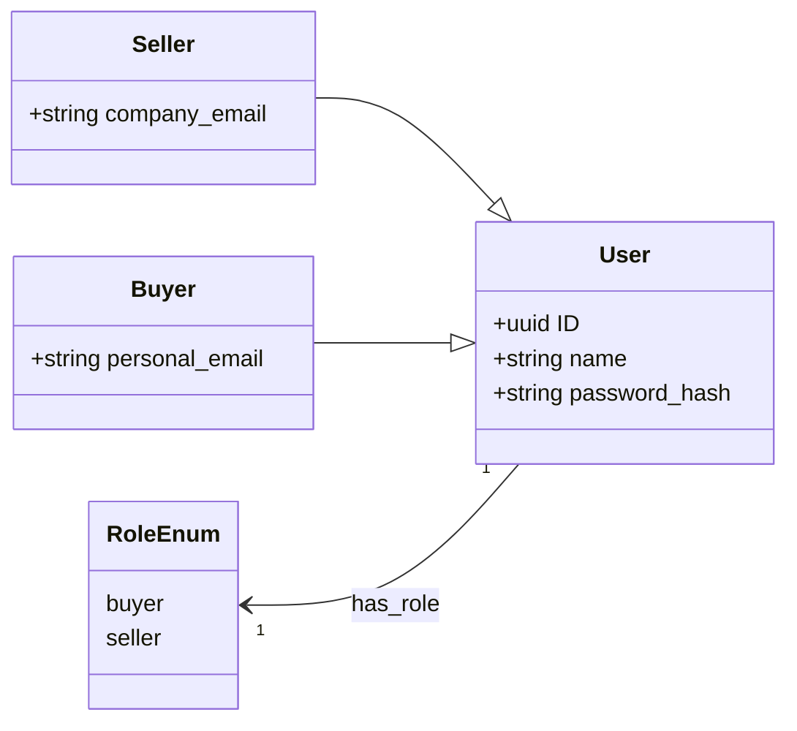

## Application

### Start

```mermaid
flowchart TD
  start((start))
  start --> A[splash screen]
  A-->B[display login screen]
  B--> C{user is already registered}
  C -- no --> CA[[register_form]]
  C -- yes --> D[inserts login credentials]

```

### Signup 

```mermaid 
flowchart TD
  subgraph register_form [register form]
    direction TB
    A((display register form))
    A --> B[user inserts role]
    B --> C{user is seller}
    C -- yes --> CA[user inserts company name, email, phone, email, password, confirm password]
    C -- no --> CB[user inserts name, email, phone, email, password, confirm password]
    CA & CB --> D[checks integritiy of data] --> Dex@{ shape: braces, label: "Makes sure that there are no spaces and, email format is correct, no spacial characters, etc"}
    D --> F[Creates User object out of data]
    F --> G([User Object])
    G --> H[[HTTP POST Register]]
    H --> I{register was successfull}
    I -- no --> Ierr[display proper errors]
    I -- yes --> J[redirect to login screen]
  end
```

### HTTP POST Signup

```mermaid
flowchart TD
  subgraph http_post_signup [HTTP POST SIGNUP]
    direction TB
    A[receives data: name, email, password, role]
    A --> B{data is complete}
    B -- no --> Berr[Error: the data is not complete] --> Breturn[response = success: false, message: Error, status:400]
    B -- yes --> C[hash password]
    C --> D[check for existing User/Email in DB]
    D --> E{user exists}
    E -- yes --> Eerr[Error: The user already exists] --> Eret[response = success: false, message: Error, status: 400]
    E -- no --> F[save user object in database]
    F --> G[prepare response data]
    G --> Gre[response = success: true, message: the user was created successfuly, status: 201]
  end
```

## Classes

```mermaid
classDiagram
  direction RL

  class User {
    +uuid ID
    +string name
    +string password_hash
  }

  class Seller {
    +string company_email
  }

  class Buyer {
    +string personal_email
  }

  class RoleEnum  {
    buyer
    seller
  }

  User <|-- Seller
  User <|-- Buyer

  User "1" --> "1" RoleEnum : has_role
```