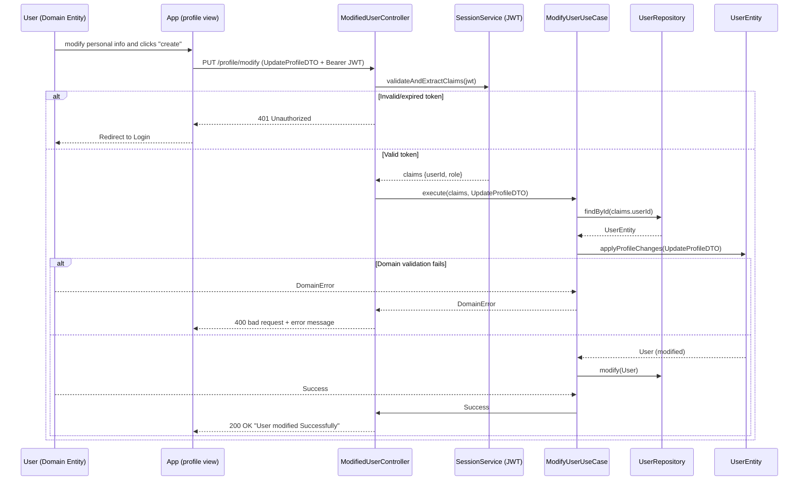
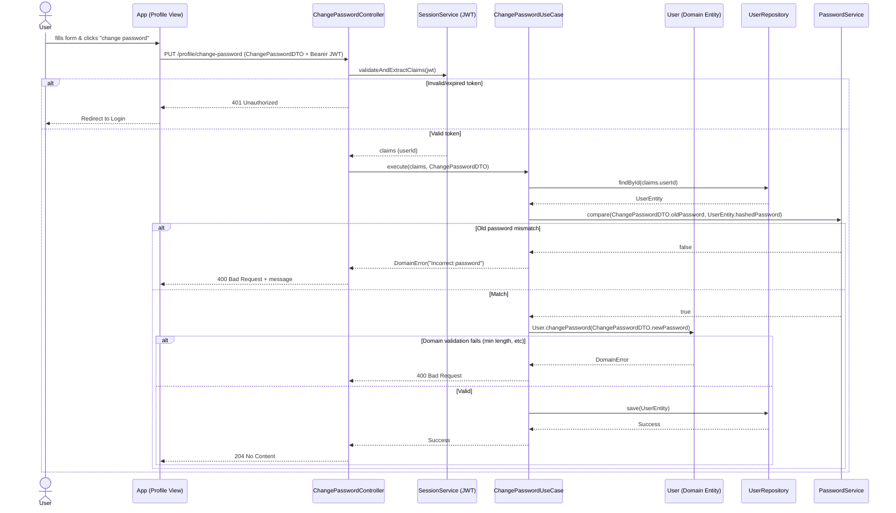
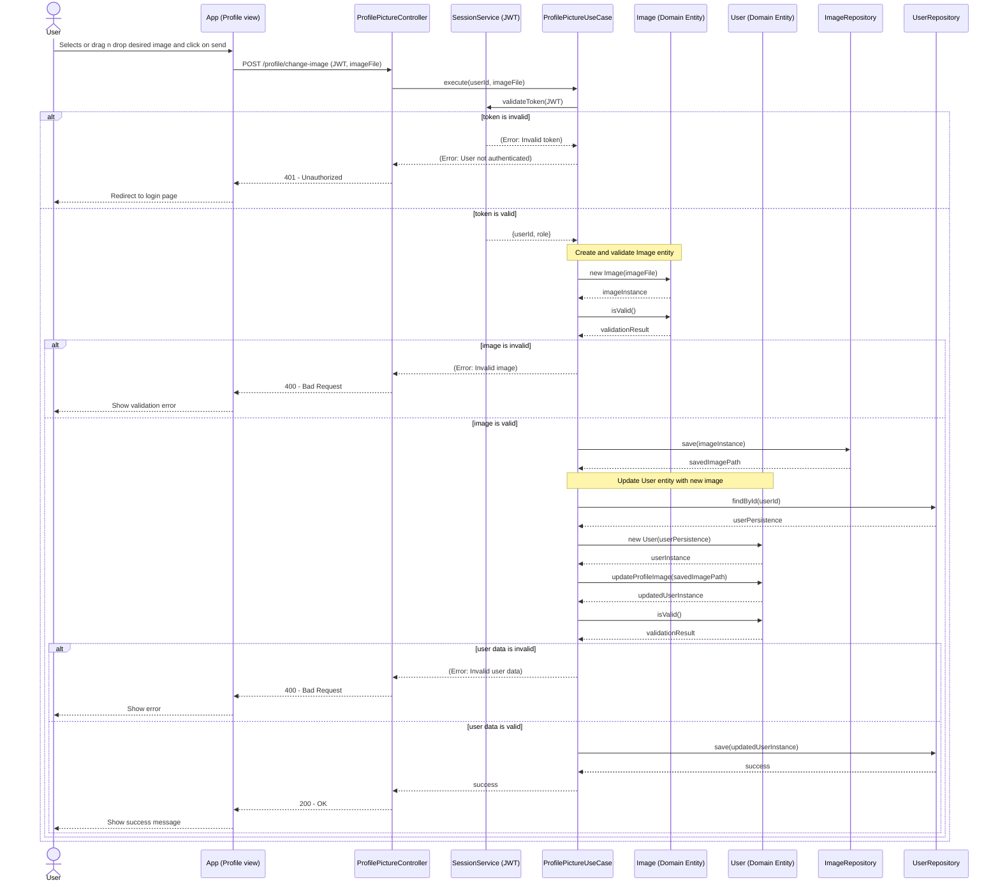

# Profile

### Modify user info

```mermaid
sequenceDiagram
  actor User
  participant UI as App (profile view)
  participant Controller as ModifiedUserController
  participant Session as SessionService (JWT)
  participant UseCase as ModifyUserUseCase
  participant User as User (Domain Entity)
  participant UserRepo as UserRepository

  User->>UI: modify personal info and clicks "create"
  UI->>Controller: PUT /profile/modify (UpdateProfileDTO + Bearer JWT)
  Controller->>Session: validateAndExtractClaims(jwt)
  alt Invalid/expired token
    Controller-->>UI: 401 Unauthorized
    UI-->>User: Redirect to Login
  else Valid token
    Session-->>Controller: claims {userId, role}
    Controller->>UseCase: execute(claims, UpdateProfileDTO)
    UseCase->>UserRepo: findById(claims.userId)
    UserRepo-->>UseCase: UserEntity
    UseCase->>UserEntity: applyProfileChanges(UpdateProfileDTO)
    alt Domain validation fails
      User-->>UseCase: DomainError
      UseCase-->>Controller: DomainError
      Controller-->>UI: 400 bad request + error message
    else
      UserEntity-->>UseCase: User (modified)
      UseCase->>UserRepo: modify(User)
      User-->>UseCase: Success
      UseCase->>Controller: Success
      Controller-->>UI: 200 OK "User modified Successfully"
    end
  end
```

### Change user password

```mermaid
sequenceDiagram
  actor User
  participant UI as App (Profile View)
  participant Controller as ChangePasswordController
  participant Session as SessionService (JWT)
  participant UseCase as ChangePasswordUseCase
  participant UserEntity as User (Domain Entity)
  participant UserRepo as UserRepository
  participant Hashing as PasswordService

  User->>UI: fills form & clicks "change password"
  UI->>Controller: PUT /profile/change-password (ChangePasswordDTO + Bearer JWT)

  Controller->>Session: validateAndExtractClaims(jwt)
  alt Invalid/expired token
      Controller-->>UI: 401 Unauthorized
      UI-->>User: Redirect to Login
  else Valid token
      Session-->>Controller: claims {userId}
      Controller->>UseCase: execute(claims, ChangePasswordDTO)

      UseCase->>UserRepo: findById(claims.userId)
      UserRepo-->>UseCase: UserEntity

      UseCase->>Hashing: compare(ChangePasswordDTO.oldPassword, UserEntity.hashedPassword)
      alt Old password mismatch
          Hashing-->>UseCase: false
          UseCase-->>Controller: DomainError("Incorrect password")
          Controller-->>UI: 400 Bad Request + message
      else Match
          Hashing-->>UseCase: true
          UseCase->>UserEntity: User.changePassword(ChangePasswordDTO.newPassword)

          alt Domain validation fails (min length, etc)
              UserEntity-->>UseCase: DomainError
              UseCase-->>Controller: 400 Bad Request
          else Valid
              UseCase->>UserRepo: save(UserEntity)
              UserRepo-->>UseCase: Success

              UseCase-->>Controller: Success
              Controller-->>UI: 204 No Content
          end
      end
  end

```

### Change user image

```mermaid
sequenceDiagram
actor User
participant UI as App (Profile view)
participant Controller as ProfilePictureController
participant Session as SessionService (JWT)
participant UseCase as ProfilePictureUseCase
participant ImageEntity as Image (Domain Entity)
participant UserEntity as User (Domain Entity)
participant ImageRepo as ImageRepository
participant UserRepo as UserRepository

User->>UI: Selects or drag n drop desired image and click on send
UI->>Controller: POST /profile/change-image (JWT, imageFile)
Controller->>UseCase: execute(userId, imageFile)
UseCase->>Session: validateToken(JWT)

alt token is invalid
    Session-->>UseCase: (Error: Invalid token)
    UseCase-->>Controller: (Error: User not authenticated)
    Controller-->>UI: 401 - Unauthorized
    UI-->>User: Redirect to login page
else token is valid
    Session-->>UseCase: {userId, role}
    
    Note over UseCase,ImageEntity: Create and validate Image entity
    UseCase->>ImageEntity: new Image(imageFile)
    ImageEntity-->>UseCase: imageInstance
    
    UseCase->>ImageEntity: isValid()
    ImageEntity-->>UseCase: validationResult
    
    alt image is invalid
        UseCase-->>Controller: (Error: Invalid image)
        Controller-->>UI: 400 - Bad Request
        UI-->>User: Show validation error
    else image is valid
        UseCase->>ImageRepo: save(imageInstance)
        ImageRepo-->>UseCase: savedImagePath
        
        Note over UseCase,UserEntity: Update User entity with new image
        UseCase->>UserRepo: findById(userId)
        UserRepo-->>UseCase: userPersistence
        
        UseCase->>UserEntity: new User(userPersistence)
        UserEntity-->>UseCase: userInstance
        
        UseCase->>UserEntity: updateProfileImage(savedImagePath)
        UserEntity-->>UseCase: updatedUserInstance
        
        UseCase->>UserEntity: isValid()
        UserEntity-->>UseCase: validationResult
        
        alt user data is invalid
            UseCase-->>Controller: (Error: Invalid user data)
            Controller-->>UI: 400 - Bad Request
            UI-->>User: Show error
        else user data is valid
            UseCase->>UserRepo: save(updatedUserInstance)
            UserRepo-->>UseCase: success
            UseCase-->>Controller: success
            Controller-->>UI: 200 - OK
            UI-->>User: Show success message
        end
    end
end
```