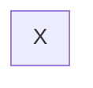
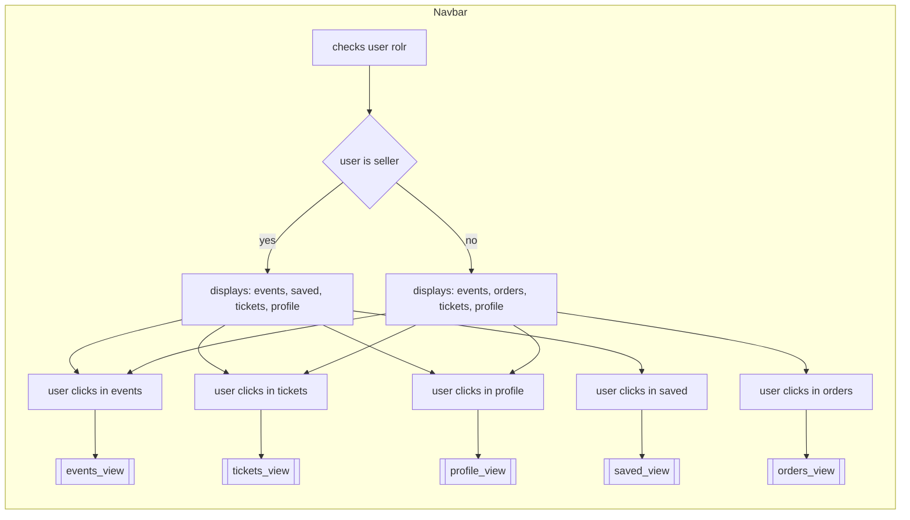

# start application

### 

```mermaid
flowchart TD
  subgraph X
  direction TB

  end

```

### navbar

```mermaid
flowchart TD
  subgraph Navbar
  direction TB
  A[checks user rolr]
  A --> B{user is seller}
  B -- yes --> C1[displays: events, saved, tickets, profile]
  B -- no --> C2[displays: events, orders, tickets, profile]
  C1 & C2 --> Devents[user clicks in events] & Dtickets[user clicks in tickets] & Dprofile[user clicks in profile]
  C2 --> Dorders[user clicks in orders]
  C1 --> Dsaved[user clicks in saved]
  Devents --> eventsEx[[events_view]]
  Dtickets-->ticketsEx[[tickets_view]]
  Dprofile-->provileEx[[profile_view]]
  Dsaved-->savedEx[[saved_view]]
  Dorders-->ordersEx[[orders_view]]
  end

```
### 

```mermaid
flowchart TD
  subgraph X
  direction TB

  end

```